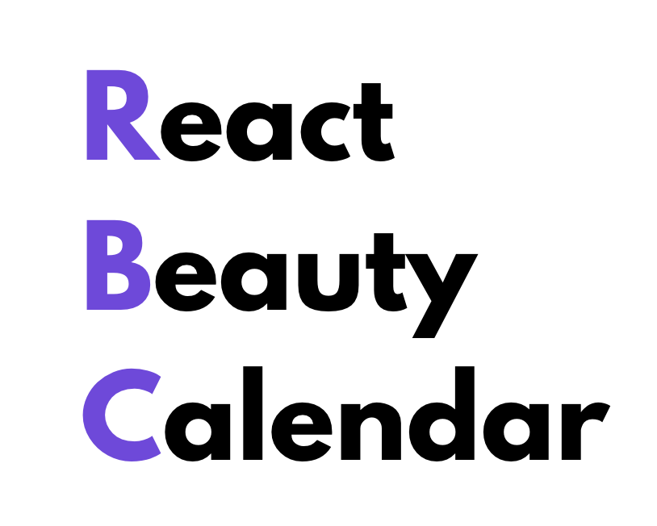

<p align="center">
  <a href="/">
    
  </a>
</p>

<h1 align="center">React Beauty Calendar - RBC </h1> 

<div>

🇬🇧 [English](README.md)
🇧🇷 [Portuguese](README-PT.md)

</div>

With the need to implement an efficient scheduling system, I decided to create a library inspired by Google Calendar and Outlook. This library offers features such as appointment creation, drag and drop, resizing, and much more. ✨

> **Note:** The current focus is on fixing performance issues.

<div align="center">

[](LICENSE)

</div>

<p align="center">An open source react calendar focused on simplicity and efficiency.</p>

## Features

- **Simple & Fast**: Minimalist interface with powerful features
- **Drag & Drop**: Advanced appointment creation
- **Open Source**: MIT licensed, free forever
- Storybook available.

## Installation
Install @RBC/react in your project with your package manager of choice:

```sh
  npm install @RBC/react
```

```sh
  yarn add @RBC/react
```

## Running the App

To run the app locally, follow these steps:

1. Clone the repository:

```sh
  git clone https://github.com/Dikendev/react-beauty-calendar.git
```

2. Navigate to the project directory:

```sh
  cd react-beauty-calendar
```

3. Install the dependencies:

```sh
  npm install
```
or
```sh
yarn install
```
4. Start the development server:

```sh
npm run dev
```

or

```sh
yarn dev
```

The app should now be running at http://localhost:5173.

### Running Storybook

To run Storybook locally, follow these steps:

1. Ensure you are in the project directory:

```sh
cd react-beauty-calendar
```

2. Start Storybook:

```sh
npm run storybook
```

```sh
yarn storybook
```
Storybook should now be running at http://localhost:6006.

## Contributing

We welcome contributions! Please see our [Contributing Guide](CONTRIBUTING.md) for details.

## New Component Proposals

Feel free to open a issue for new ideas and contributions.

## Contact
  
For bug reports and feature requests, please use the issue tracker of this repository.

## License

This project is licensed under the [MIT License](LICENSE) 2025.
